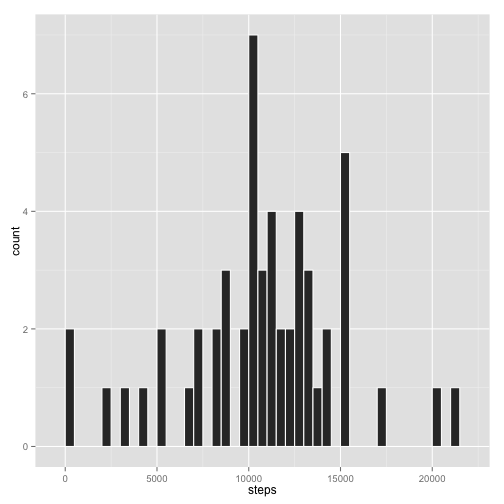

#  
# Assignment 1 for Reproducible Research Course  

This is the Assignment 1 for the Reproducible Research assignment 1 written as a R Markdown document.


## First step: Load the data.

1- "activity.csv" is read (from the working directory) into the dataframe "data"  
2- then the date format is corrected.  


```r
data<-read.csv("activity.csv")
data$date<-as.Date(data$date,"%Y-%m-%d")
```

## Second step Determine mean and median  
## total number of steps taken per day

1- The number of steps per day is determined by the aggregate function  
which aggregates the dataframe based on same days, and sums the steps per day.  
The *"interval"* column is then dropped:  


```r
daysteps<-aggregate(. ~ date, data=data, FUN=sum)
daysteps$interval<-NULL
```

2- Create a Histogram of the total number of steps taken each day:  
 


```r
ggplot(daysteps, aes(steps)) + geom_histogram(binwidth = 1000, colour="white")
```

 

3- And calculate the **mean** and **median** total number of steps per day   


```r
mean<-mean(daysteps$steps)
median<-median(daysteps$steps)
```
The mean is 1.0766 &times; 10<sup>4</sup>, and the median is 10765.  

## Third step: Determine the average daily activity pattern  

1- The number of steps per 5-minute interval is determined by the aggregate  
function that aggregates the dataframe based on same 5-minute intervals,  
and averages the number of steps per 5-minute interval, by dividing the  
sum by the number of days (61).   
The *"date"* column is then dropped:


```r
x<-data
x$date<-NULL
x<-aggregate(. ~ interval, data=x, FUN=sum)
x$steps<-x$steps/61
plot(x$interval,x$steps, type="l",xlab="5-minute interval of the day",ylab="Average Steps")
```

 


## Forth step: Inputing missing values  

1- Calculate and report the total number of missing values in the dataset  
(i.e. the total number of rows with NAs):


```r
l<-dim(data[!complete.cases(data),])[1]
```

There are 2304 rows with at least one NA.  

2- Devise a strategy for filling in all of the missing values in the dataset.  
We use the mean for that 5-minute interval to fill in any missing steps value.  

2.1- We start by identifying the rows with the missing steps values   
  in a boolean vector ("*bad*")  
2.2- We create a vector of same lenght (61days) only with the averages  
  for each interval ("*averages*")  
2.3- We multiply "*averages*" by the "*bad*" to obtain the missing  
  values ("*missing*")  
2.4- We create a new dataset where we replace the NAs on the "*steps*"  
  column with "*0*"  
2.5- Finally, we add the "*missing*" vector as a column to the "*steps*"  
  column in "*data*"  


```r
bad<-!complete.cases(data$steps)
averages<-rep(x$steps,61)
missing<-bad*averages
newdata<-data
newdata[is.na(newdata)] <- 0
newdata$steps<-newdata$steps+data.frame(missing)[,1]
```


