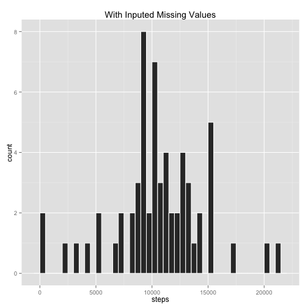
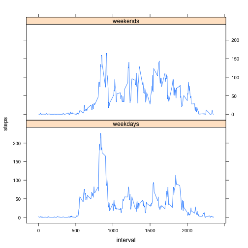

#  
# Assignment 1 for Reproducible Research Course  

This is the Assignment 1 for the Reproducible Research assignment 1 written as a R Markdown document.


## Part 1: Load the data.

1- "activity.csv" is read (from the working directory) into the dataframe "data"  
2- then the date format is corrected.  


```r
data<-read.csv("activity.csv")
data$date<-as.Date(data$date,"%Y-%m-%d")
```

## Part 2: Determine mean and median  
## total number of steps taken per day

1- The number of steps per day is determined by the aggregate function  
which aggregates the dataframe based on same days, and sums the steps per day:  


```r
daysteps<-aggregate(. ~ date, data=data, FUN=sum)
```

2- Create a Histogram of the total number of steps taken each day:  
 


```r
ggplot(daysteps, aes(steps)) + geom_histogram(binwidth = 500, colour="white") 
```

 

3- And calculate the **mean** and **median** total number of steps per day   


```r
mean<-mean(daysteps$steps)
median<-median(daysteps$steps)
```
The mean is 1.0766 &times; 10<sup>4</sup>, and the median is 10765.  

## Part 3: Determine the average daily activity pattern  

1- The number of steps per 5-minute interval is determined by the aggregate  
function that aggregates the dataframe based on same 5-minute intervals,  
and averages the number of steps per 5-minute interval, by dividing the  
sum by the number of days (**61**).   
The *"date"* column is then dropped:


```r
x<-data
x$date<-NULL
x<-aggregate(. ~ interval, data=x, FUN=sum)
x$steps<-x$steps/61
plot(x$interval,x$steps, type="l",xlab="5-minute interval of the day",ylab="Average Steps")
```

 


## Part 4: Inputing missing values  

### 1- Calculate and report the total number of missing values in the dataset  
 (i.e. the total number of rows with NAs):


```r
l<-dim(data[!complete.cases(data),])[1]
```

There are 2304 rows with at least one NA.  

### 2- Devise a strategy for filling in all of the missing values in the dataset.  

We use the mean for that 5-minute interval to fill in any missing steps value.  

2.1- We start by identifying the rows with the missing steps values   
  in a boolean vector ("*bad*")  
2.2- We create a vector of same lenght (61days) only with the averages  
  for each interval ("*averages*")  
2.3- We multiply "*averages*" by the "*bad*" to obtain the missing  
  values ("*missing*")  
2.4- We create a new dataset where we replace the NAs on the "*steps*"  
  column with "*0*"  
2.5- Finally, we add the "*missing*" vector as a column to the "*steps*"  
  column in "*data*"  

### 3- Create the new dataset as described above:  


```r
bad<-!complete.cases(data$steps)
averages<-rep(x$steps,61)
missing<-bad*averages
newdata<-data
newdata[is.na(newdata)] <- 0
newdata$steps<-newdata$steps+data.frame(missing)[,1]
```


### 4- Make a histogram with the total number of steps taken each day

4.1- As with Part 2, use the aggregate function to aggregate  
the dataframe based on same days, and sum the steps per day.


```r
newdaysteps<-aggregate(. ~ date, data=newdata, FUN=sum)
```

4.2- Create a Histogram of the total number of steps taken each day:  


```r
ggplot(newdaysteps,aes(steps))+geom_histogram(binwidth=500,colour="white")+ggtitle("With Inputed Missing Values")
```

 

4.3- And calculate the **mean** and **median** total number of steps per day   


```r
newmean<-mean(newdaysteps$steps)
newmedian<-median(newdaysteps$steps)
```
The mean is 1.0581 &times; 10<sup>4</sup>, and the median is 1.0395 &times; 10<sup>4</sup>.  

## Part 5: Activity Patterns: Weekdays vs Weekends

This final part of the assignment is to determine diferences in the 5-minute intervals average number of steps between weekdays and weekends.   

To do this the following sequence is applied to the data:  

1- Create a new factor variable in the dataset with two levels – “weekday” and “weekend” indicating whether a given date is a weekday or weekend day, and save in a new dataset ("*newdata2*")

```r
newdata2<-transform(newdata, weekend=as.POSIXlt(date, format='%Y/%m/%d')$wday %in% c(0, 6))
```

2- The data is subsetted into two datasets, one for "*weekdays*" and one for "*weekends*"

```r
weekdays<-subset(newdata2, weekend==FALSE)
weekdays$date<-NULL
weekends<-subset(newdata2, weekend==TRUE)
weekends$date<-NULL
```

3- For each of the two new datasets, the  number of steps per 5-minute   
interval is determined by the aggregate function that aggregates the dataframe  
based on same 5-minute intervals, and then averaged the number of steps per  
5-minute interval by dividing the sum by the number of days (**45** weekdays, and **16** weekend days). 

```r
weekdays<-aggregate(. ~ interval, data=weekdays, FUN=sum)
weekends<-aggregate(. ~ interval, data=weekends, FUN=sum)

weekdays$steps<-weekdays$steps/45
weekends$steps<-weekends$steps/16
```


4- We add a factor "*day*" indicating each row to be "*weekdays*" or "*weekends*", and combine both datasets into the "*finaldata*" dataset.  

```r
weekdays$day<-"weekdays"
weekends$day<-"weekends"

finaldata<-rbind(weekdays,weekends)
```

5- A panel plot is made containing a time series plot (i.e. type = "l") of the 5-minute interval (x-axis) and the average number of steps taken, averaged across all weekday days or weekend days (y-axis).   

```r
print(xyplot(steps ~ interval | day, data =finaldata, layout=c(1,2), type="l"))
```

 
